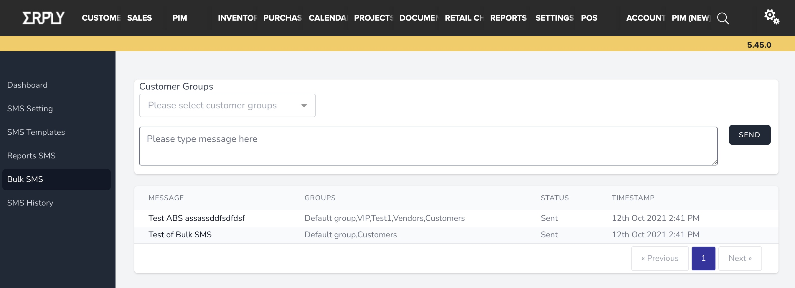
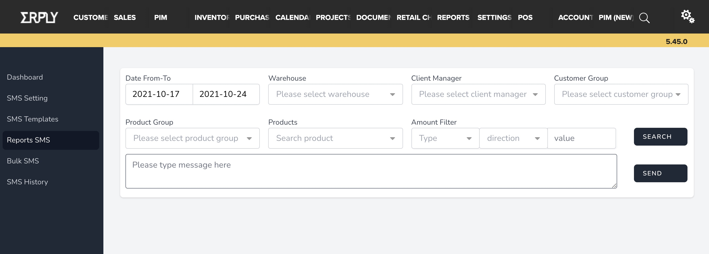
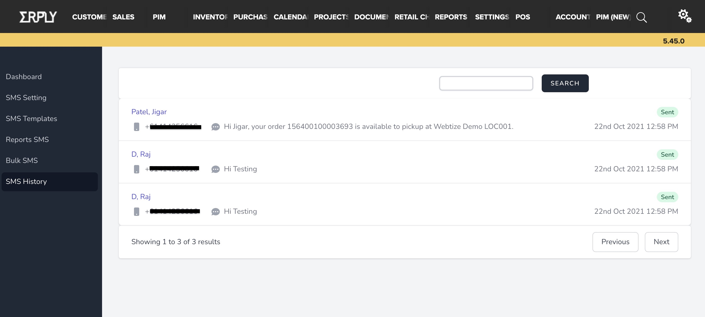
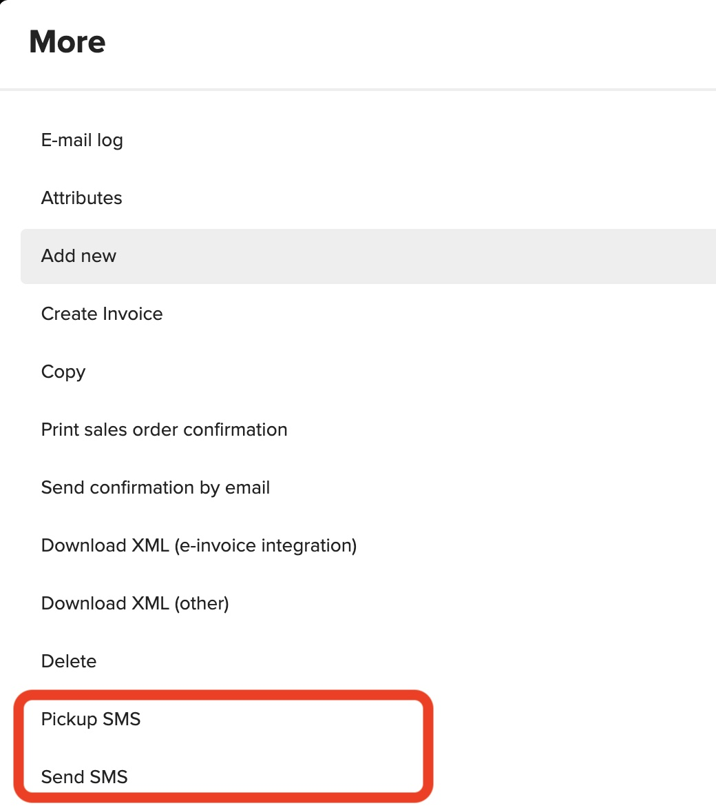
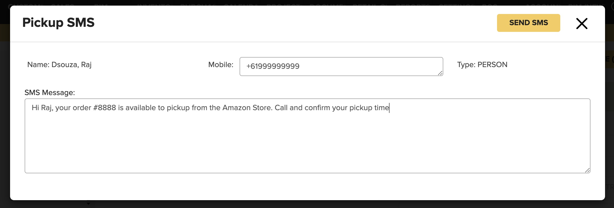

Features
=====

Sms notification has many built-in features which can help communicate with your customers.

* Bulk SMS :ref:`Bulk SMS`
* Campaign
* SMS History
* Pickup SMS
* No SMS sent if Opt-out selected

Bulk SMS
------------
Send messages to all your customers or based on customer groups

Report SMS / Campaign
------------
Send messages conditionally based on activity complated by you customers for eg.

* If a customer had purchased products from a particular product group or a particular product
* If customers have purchased over or under a certain value

SMS History
------------
Monitor all messages sent from your account and search based on customers

Pickup SMS / Send SMS
-----------
Send customers a message to alert them to pickup goods on a order or a custom messages from an invoice.
Simple press F4 or click the three dot in you invoice or order and click the menu you desire.

