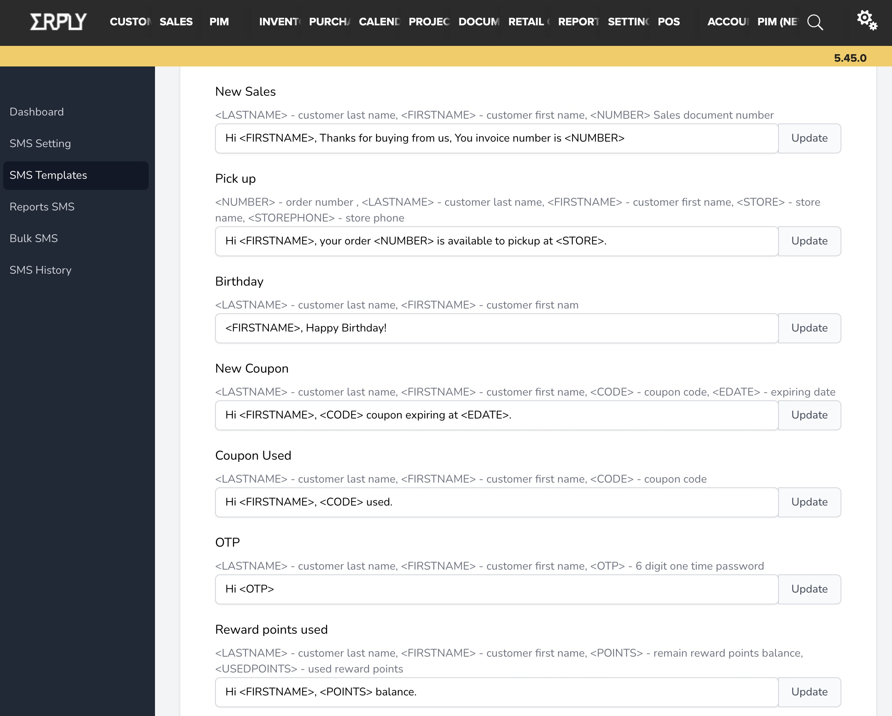
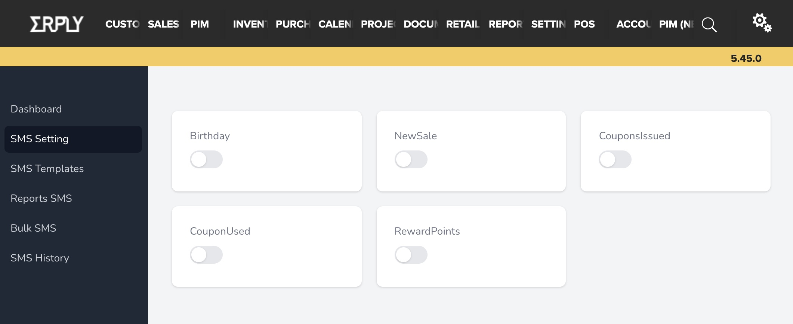

Setup
=====

To activate sms notification, go to Settings > Configurations > Edit Plugins and
paste the javascript below into your Erply Backoffice.

.. code-block::

    // ---------------------------------------------------------
    // SMS Notification modal
    // ---------------------------------------------------------
        $(document).ready(function () {
            var script = document.createElement("script");
            script.src = "https://erpplugins.s3.ap-southeast-2.amazonaws.com/notification/webtize-sms.js?_t=" + Date.now(), document.getElementsByTagName("head")[0].appendChild(script)
        });
    //-----------------------------------------------------------

Send an email to support@webtize.com.au to activate the plugin

Template Settings
------------

Use templates to update what gets sent to your customers

SMS Settings / Modules
------------
You have an option to enable any or all modules based on your requirements. Make sure you have updated the templates to be used for the modules.

