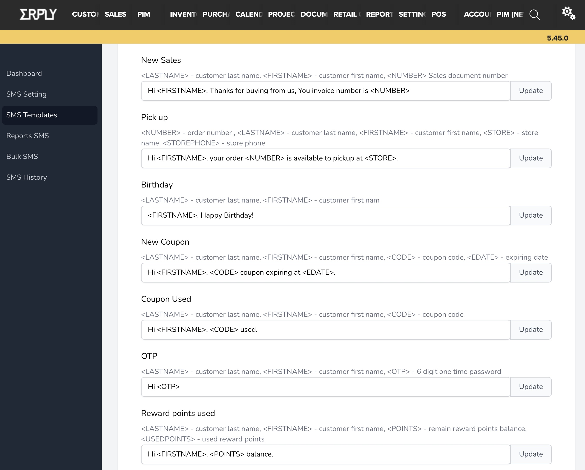

Setup
=====

.. _installation:

Template Settings
------------

Use templates to update what gets sent to your customers

For example:

>>> import lumache
>>> lumache.get_random_ingredients()
['shells', 'gorgonzola', 'parsley']

